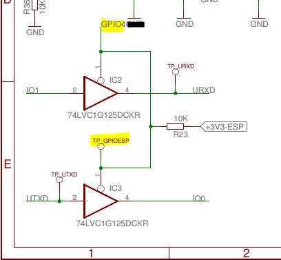

# Arduino Uno WiFi Developer Edition 
## Content
  * [Hardware](#hardware)
  * [Firmware](#firmware)
      * [Preparing for flashing](#preparing-for-flashing)
      * [esptool](#esptool)
      * [Firmware as a sketch](#firmware-as-a-sketch)
  * [Connecting to WiFi network](#connecting-to-wifi-network)
  * [ESP8266 Firmwares overview](#esp8266-firmwares-overview)
     * [Uno WiFi Developer Edition factory firmware](#uno-wifi-developer-edition-factory-firmware)
     * [ESP-link](#esp-link)
     * [WiFi Link](#wifi-link)
     * [SDK firmware](#sdk-firmware)
 * [WiFi Link firmware](#wifi-link-firmware)
     * [Initial serial flashing](#initial-serial-flashing)
     * [Building from source code](#building-from-source-code)
     * [AVR sketch OTA upload support](#avr-sketch-ota-upload-support)
     * [Straight serial connection](#straight-serial-connection)
 

## Hardware

Arduino Uno WiFi Developer Edition is an Arduino UNO R3 with ESP8266 integrated on the board. It was developed and manufactured by Arduino.org. ["Getting started"](https://www.arduino.cc/en/Guide/ArduinoUnoWiFi) tutorial is now on the arduino.cc site.

ESP8266 is a ‘WiFi chip’  often used in combination with Arduino microcontrollers. Classic way is to connect the AVR or other microcontroller with ESP8266 using UART (Serial). Other way of connecting AVR with ESP uses SPI connection.

Arduino Uno WiFi Developer Edition connects ATmega328 microcontroller to ESP8266 using additional UART chip SC16IS750 ([here as module](http://sandboxelectronics.com/?product=sc16is750-i2cspi-to-uart-bridge-module)). This additional UART is connected to Atmega as I2C device.

With ESP8266 on board it is desired to use it to write into microcontroller a sketch send ‘over the air’. ‚Over the air‘ or OTA upload means the sketch is send from IDE to the board using WiFi.

To write an AVR program received over WiFi into AVR, the ESP must be connected to AVR’s serial pins. For this to work there is a direct serial to serial connection on Uno WiFi Developer Edition. The electronic switch which connects this serial to serial is controlled with pin 4 of the ESP8266.


[arduino-uno-wifi-schematic.pdf](doc/Arduino-UNO-WiFi-V4_AF1.pdf)

## Firmware

The program of a device installed in the factory is called a firmware. In case of Uno WiFi the firmware is the program in the ESP8266. The purpose is to serve as a network interface for the program (sketch) in the AVR microcontroller and provide Web Panel for setup of the WiFi connection.

**Warning: While experimenting with firmware there is always a risk of bricking your device.** 

### Preparing for flashing

The firmware can be updated or changed. Two things are necessary to prepare Uno WiFi Dev Ed for writing the firmware to the ESP8266 flash memory (flashing). 

1. First step is bridging the USB serial of the AVR microcontroller to ESP8266 serial pins. It is a software thing. A simple sketch called EspRecovery from Examples of "Arduino Uno WiFi Dev Ed Library". Upload it into microcontroller.
2. Second step is to put the ESP8266 into so called DFU mode pushing a dedicated button while powering the board on.  


### esptool

All firmware binaries available for Uno Wifi Dev Ed can be flashed with esptool. The Arduino IDE plugin for upgrading the preinstalled firmware version installs esptool under the tools folder of the sketch folder - Arduino/tools/UnoWiFi/tool/bin

esptool parameters for the Uno WiFi Dev Ed are `-b 9600 write_flash -ff 80m -fm qio -fs 32m` 

(The connection over Atmega with EspRecovery sketch is for some yet unknown reason good for communication with esp8266 bootloader only at 9600 baud.) 

The exe version of the esptool is a packaged version of the python script esptool.py

* [esptool.py GitHub repository and reference](https://github.com/espressif/esptool)
 
### Firmware as a sketch
 
ESP8266 is supported in Arduino IDE with Arduino esp8266 core. It means that arduino sketch can be uploaded into ESP8266. The WiFi Link firmware is a sketch which can be build and uploaded with the Arduino IDE upload button. 

## Connecting to WiFi network

With factory firmware and other firmwares-with-Web-Panel the Uno WiFi network configuration uses the configuration Access Point (AP). User connects to the WiFi network created by a device, goes to fixed IP address URL and configures the network access in a Web Panel. The device connects in STA mode to the selected WiFi network and is accessible at IP address assigned by a DHCP or a static address set in Web Panel.

The Uno WiFi WiFi network has a name "Arduino-Uno-WiFi-xxxxxx" with arduino.org firmwares and "ESP-xxxxxx" with JeeLabs firmware. The fixed address in AP mode is http://192.168.240.1/ for the arduino.org firmwares and http://192.168.4.1/ with JeeLabs firmware.

After every restart the ESP8266 is for some time in AP+STA mode to allow changing the settings if the network selected for STA mode is not accessible.

* [First configuration with factory firmware](https://www.arduino.cc/en/Guide/ArduinoUnoWiFi#toc12)

**The AVR sketch doesn't need to connect to a WiFi network. It can use the connection created by ESP8266 with Web Panel settings. Don't use WiFi.begin, only put a 5 seconds delay to the start of the sketch to let ESP8266 time to initialize after board's power-up.**

## ESP8266 Firmwares overview

### Uno WiFi Developer Edition factory firmware

The Arduino.org team did use a JeeLabs ESP-link fork (source code copy) with minor changes for the firmware of the Uno WiFi Developer Edition. They changed the design to Arduino and made sketch OTA upload work activating pin 4 before writing the sketch’s binary to AVR.

With IDE 1.8.x the library for the AVR side of this firmware is “Arduino Uno WiFi Dev Ed Library”. The network communication possibilities are limited to port 80 and MQTT. The library can be installed with Library Manager in IDE. 

This firmware can be installed or reinstalled with [firmware updater with GUI](https://www.arduino.cc/en/Guide/ArduinoUnoWiFiFwUpdater).

* [UnoWiFi-FirmwareUpdater-Plugin](https://github.com/arduino-libraries/UnoWiFi-FirmwareUpdater-Plugin/releases)
* [Source code GitHub repository](https://github.com/arduino-org/Esp-Link)

### ESP-link

Then version of ESP-link was used for the preinstalled firmware. JeeLabs develops the ESP-link further and it is compatible with Uno WiFi Developer Edition, except of sketch OTA upload.

The library for the AVR side is called EL-link and for the Uno WiFi Developer Edition it must use the SC16IS750 interface.

* [ESP-link firmware GitHub repository](https://github.com/jeelabs/esp-link)
* [EL-link library GitHub repository](https://github.com/jeelabs/el-client)

### WiFi Link

The WiFi Link firmware is an ESP8266 arduino sketch developed by Arduino.org in Arduino IDE using Arduino esp8266 core. It was developed for the Arduino Star Otto, Arduino Primo and Uno WiFi.

Sketch OTA upload is in WiFi Link firmware implemented only in the 'ota' branch.

The corresponding library is WiFi Link and it has a familiar API similar to WiFi and Ethernet library.

* [WiFi Link firmware GitHub repository](https://github.com/arduino-org/arduino-firmware-wifilink)
* [WiFi Link library GitHub repository](https://github.com/arduino-org/arduino-library-wifilink)

### SDK firmware

Theoretically it should work. It receives AT commands over serial line. 

Possible library is WifiEsp over [SC16IS750 object](https://github.com/SandboxElectronics/UART_Bridge), which implements the Serial interface. 

## WiFi Link firmware

**Warning: While experimenting with firmware there is always a risk of bricking your device.**

### Initial serial flashing

The GitHub repository of the WiFi Link firmware contains [binaries of version 1.0.0](https://github.com/arduino-org/arduino-firmware-wifilink/releases/tag/1.0.0). There are two files:

* `ArduinoFirmwareWiFiLink-UNO_WIFI_DEV_ED-1.0.0.bin` - to write from address 0, contains bootloader and the firmware functions. 
* `ArduinoFirmwareWiFiLink-WEB_PANEL-1.0.0.bin` - to write from flash address 0x300000. It is an image of ESP file system SPIFFS, containing static files for the Web Panel. The file is 1 MB big.

For flashing you need the esptool. You can use the python script or if you installed "Uno WiFi Updater Plugin", then you can use packaged esptool from tools/UnoWiFi/tool/bin in your sketches folder Arduino/.

If you didn't install the "Arduino Uno WiFi Dev Ed Library", install the WiFi Link library. You will need the EspRecovery sketch from examples of one of these libraries.

1. Create a folder ArduinoFirmwareWiFiLink in tools subfolder of your sketches folder (Arduino/tools). 
2. Download the release 1.0.0 .bin files into folder Arduino/tools/ArduinoFirmwareWiFiLink
3. In Arduino IDE open the sketch EspRecovery from Examples of "Arduino Uno WiFi Dev Ed Library" or WiFi Link library
4. Connect the board and upload the EspRecovery sketch
5. Put the ESP on Uno WiFi into DFU mode - disconnect the board from power and then hold the DFU button while connecting the USB cable. 
6. open the command line and go to folder Arduino/tools/ArduinoFirmwareWiFiLink. (on Windows `cd %USERPROFILE%\Documents\Arduino\tools\ArduinoFirmwareWiFiLink`)
7. execute esptool with parameters. The first parameter -p should be the serial port where the Arduino is connected. All other parameters are the same for all setups: `-b 9600 write_flash -ff 80m -fm qio -fs 32m 0x000000 ArduinoFirmwareWiFiLink-UNO_WIFI_DEV_ED-1.0.0.bin 0x300000 ArduinoFirmwareWiFiLink-WEB_PANEL-1.0.0.bin`

Windows example with "Uno WiFi Updater plugin" esptool:
```
C:\Users\Duro\Documents\Arduino\tools\ArduinoFirmwareWiFiLink>..\UnoWiFi\tool\bin\esptool-windows -p COM4: -b 9600 write_flash -ff 80m -fm qio -fs 32m 0x000000 ArduinoFirmwareWiFiLink-UNO_WIFI_DEV_ED-1.0.0.bin 0x300000 ArduinoFirmwareWiFiLink-WEB_PANEL-1.0.0.bin 
```

It takes to 20 minutes to write the bin files at 9600 baud. Limitation is the connection between microcontroller and ESP8266 over IO expander. 

After successful flashing of the firmware you can connect to AP created by the ESP8266 and setup the connection to your WiFi network. The process is very **similar** to [first configuration with factory firmware](https://www.arduino.cc/en/Guide/ArduinoUnoWiFi#toc12).

Use [WiFi Link library](https://github.com/arduino-org/arduino-library-wifilink) in sketches.

### Building from source code

The WiFi Link firmware is an Arduino sketch so you can build it in Arduino IDE and upload it to ESP from Arduino IDE. There is no need for some linux toolchains like is the case with other ESP firmwares.

Building WiFi Link firmware from source files gives you possibility to build the newest version, build a branch version, build some fork version or change something in source code you need.

#### Install esp8266 packages

Arduino Uno Wifi Dev Ed is supported from version 2.4 of the esp8266 core for Arduino IDE. For now, the version 2.4 is only a release candidate.

To install this pre-release using boards manager, follow the [instructions](https://github.com/esp8266/Arduino#installing-with-boards-manager), with the package URL replaced with the following one:
```
https://github.com/esp8266/Arduino/releases/download/2.4.0-rc1/package_esp8266com_index.json
```

Additionally, install the [Arduino ESP8266 filesystem uploader IDE plugin](https://github.com/esp8266/arduino-esp8266fs-plugin#arduino-esp8266-filesystem-uploader-)

#### Download the source code

For start use the source code from the [master repository from Arduino.org](https://github.com/arduino-org/arduino-firmware-wifilink). Every GitHub repository has a green "Clone or download" button which opens a small menu. Choose "Download ZIP".

Open or extract the downloaded zip and copy the folder ArduinoFirmwareEsp from zip to your sketches folder.

Start Arduino IDE and open the ArduinoFirmwareEsp.ino sketch. It opens additional files as tabs in IDE.

Go to config.h tab and uncomment `#define UNOWIFIDEVED`.

#### Board selection and Verify

In tools menu select board options. 

1. Choose Arduino from the ESP8266 section of the Boards menu. 
2. Next choose Model Uno Wifi. 
3. Flash Size selection should be "4M (1M SPIFFS)"  

Now verify the sketch with the Verify button. The first compilation after changing the board will take time.

From now on always check the selected board in the right bottom corner of the IDE window. For AVR sketch it should show "Arduino Uno Wifi on ...", for the ESP sketch "Arduino, Uno WiFi, 9600, 4M (1MB SPIFFS) on...".

#### OTA upload 

The WiFi Link firmware supports OTA upload of new version of the firmware binary. OTA upload will only work if some version of WiFi Link is working in the ESP8266 of your Uno WiFi Dev Ed and is configured to STA or STA+AP mode.

After configuring the board to WiFi STA or STA+AP mode, the IDE will detect your board on network using mdns. The network 'port' will be accessible in Port submenu of Tools menu. Choose the network port for the OTA upload and use the Upload button in IDE.

The upload of the ArduinoFirmwareEsp.ino will overwrite the bootloader+firmware binary at address 0x0 and leave the SPIFFS part of the flash unchanged.

*Notes: Do not put the board in DFU mode. Do not search for some special programmer in Tools menu.*

#### Serial upload

*OTA upload should work. If not, take time to make it work. With serial upload the chance of bricking your board is higher.*  
 
For the serial upload you must prepare the board with EspRecovery sketch and DFU mode. 

Choose the serial port in Tools menu Port and try to upload with the Upload button, but it is possible it ends with an error.

Other option is to use command "Export compiled binary" from Sketch menu. It creates file named ArduinoFirmwareEsp.ino.arduino_uart.bin in sketch source code folder Arduino/ArduinoFirmwareEsp.

To flash with esptool:
1. Create a folder ArduinoFirmwareWiFiLink in tools subfolder of your sketches folder (Arduino/tools), if it doesn't exist.
2. move Arduino/ArduinoFirmwareEsp/ArduinoFirmwareEsp.ino.arduino_uart.bin to Arduino/tools/ArduinoFirmwareWiFiLink
3. In Arduino IDE open the sketch EspRecovery from Examples of "Arduino Uno WiFi Dev Ed Library" or WiFi Link library
4. Connect the board and upload the EspRecovery sketch (don't forget to set the board to Arduino Uno Wifi)
5. Put the ESP on Uno WiFi into DFU mode - disconnect the board from power and then hold the DFU button while connecting the USB cable.
6. open the command line and go to folder Arduino/tools/ArduinoFirmwareWiFiLink. (on Windows `cd %USERPROFILE%\Documents\Arduino\tools\ArduinoFirmwareWiFiLink`)
7. execute esptool with parameters. The first parameter -p should be the serial port where the Arduino is connected. All other parameters are the same for all setups: `-b 9600 write_flash -ff 80m -fm qio -fs 32m 0x000000 ArduinoFirmwareEsp.ino.arduino_uart.bin`

The procedure is basically the same as described in "Initial serial flashing". The name of the bin file is different and we don't provide the SPIFFS binary for address 0x300000 because it is already flashed from initial flashing. **The flashing without the 1MB SPIFFS binary is much quicker and doesn't erase the setup for your wifi network.**

Windows example with "Uno WiFi Updater Plugin" esptool:
```
C:\Users\Duro\Documents\Arduino\tools\ArduinoFirmwareWiFiLink>..\UnoWiFi\tool\bin\esptool-windows -p COM4: -b 9600 write_flash -ff 80m -fm qio -fs 32m 0x000000 ArduinoFirmwareEsp.ino.arduino_uart.bin 
```

If you didn't do the initial flashing of WiFi Link firmware 1.0.0 binaries, then you need to flash the SPIFFS binary to address 0x300000. You can use the release 1.0.0 binary ArduinoFirmwareWiFiLink-WEB_PANEL-1.0.0.bin. Add it to the command above or execute it separately. Flashing the SPIFFS erases the settings made in Web Panel and the board returns to AP mode.

#### SPIFFS
 
SPIFFS is the file system for ESP8266. 
 
In subfolder data of the source codes of the WiFi Link firmware are the static web files (html, css, js) for the Web Panel. You can add your own files and they will be accessible on expected url.
 
We installed a plugin tool in chapter "Install esp8266 packages". This plugin creates a "ESP8266 Sketch Data upload" command in Tools menu.
 
The tool builds the SPIFFS binary and uploads it to selected port. **With network port it will use OTA and it is fast.** 

With serial port you must use EspRecovery sketch and put the board in DFU mode. If you must do a serial flashing and the IDE upload doesn't work, find the created binary and flash it with esptool on address 0x300000. The path to the binary file is in 'verbose' output mode on IDE console.

Flashing the SPIFFS erases the WiFi settings made in Web Panel and the board starts in AP mode.

#### config.json

WiFi Link firmware writes WiFi settings into SPIFFS file config.json. SPIFFS upload overrides the SPIFFS content and the setting are lost. After restart WiFi Link firmware goes to AP mode and you must once again connect to this AP, choose the WiFi network, enter the password and connect back to your WiFi. 

If you often upload the SPIFFS, add your config.json file into data subfolder of the WiFi Link firmware source codes. The basic content is `{"ssid":"yourwifi","password":"yourpassword"}.` 

### AVR sketch OTA upload support

The WiFi Link firmware build from the master branch of the GitHub repository doesn't support AVR sketch OTA upload. The sketch OTA upload is implemented only in the 'ota' branch. To build from the source codes of the ota branch we need a library called dfu.

#### The dfu library

The dfu library is not available in Library manager in IDE. The source code repository is on [GitHub](https://github.com/ciminaghi/libdfu/tree/arduino-debug). And it is not an arduino library. First running a script from arduino subfolder builds the arduino version.

Step to arduino version of the dfu library:
1. download the source code zip from the 'arduino-debug' branch in some temporary folder
2. run the bash script from arduino subfolder. It creates a zip with the arduino library
3. install the library zip with IDE or extract it to your libraries folder

#### Compiling the WiFi link firmware 'ota' branch

The current source code in arduino-org/arduino-firmware-wifilink/ota needs a small change with 'arduino-debug' version of the dfu libray. In ArduinoMcuOTA.ino delete the line `#include <dfu-avrisp.h>`. 

If the firmware compiles you can upload it into ESP8266.

#### Sketch OTA upload tool

Tool for OTA uploading the mcu sketch is a python script available in arduino.org [GitHub repository](https://github.com/arduino-org/arduino-tool-mcu-ota). To run it, you need Python 2.7, 3.x doesn't work. With python installed you can package the script as exe. Instructions are in the GitHub repository.

#### IDE integration

A way to integrate the tool arduino-tool-mcu-ota into IDE is patching the platform.txt file, but the file locations sometimes change with IDE versions.

The platform.txt values to change are 
```
tools.avrdude.network_cmd={runtime.tools.arduinoOTA.path}/bin/arduino_mcuota
tools.avrdude.upload.network_pattern="{network_cmd}" -i {serial.port} -p {upload.network.port} -f "{build.path}/{build.project_name}.hex"
```

Put the tool executable to a location evaluated by tools.avrdude.network_cmd.

### Straight serial connection 

On Uno WiFi Dev Ed the standard connection thru SC16IS750 is limited for unknown reason to 9600 baud, which is very slow. There is a way to use a direct Atmega to ESP serial connection at 115200 baud.

With the serial of Atmega connected to ESP8266 it can’t be used for USB sketch uploading and Serial Monitor as it is the case with other equipment connecting to UART serial connection.

Alternative to uploading sketch over USB is OTA upload. Alternative to Serial Monitor is Telnet.

Warning: use firmware which activates the straight serial connection only if you mastered firmware OTA upload.

#### Pin 4

Pin GPIO4 of the ESP8266 is on Uno WiFi Dev Ed connected to an electronic switch which opens the direct serial communication between ATmega328 and ESP8266. The pin 4 must be changed to LOW to activate the serial line. 

The same effect has a hardware patch - [connecting the point TP_GPIOESP to ground](doc/TP_GPIOESP_GND.jpg)



This direct connection can be set to higher baudrate then the path thru IO expander. Tested is 115200 baud. 

The hardware activation of the direct connection can help with serial flashing of esp firmware of seemingly bricked Uno WiFi.

#### Changed firmware

[This](https://github.com/jandrassy/arduino-firmware-wifilink/tree/ota) source code GitHub repository with WiFi Link ota branch fork has among other changes #ifdefs for the 'straight' serial connection.

#### Changed library

The original WiFi Link library can not be used because it assumes that SC16IS750 should be used if `__AVR_ATmega328P__` is defined. SC16IS750 must be 'cut out' like in [the 'straight-serial' branch in a fork of WiFi Link library](https://github.com/jandrassy/arduino-library-wifilink/tree/straight-serial).
